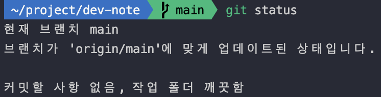
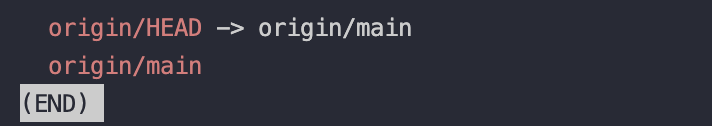
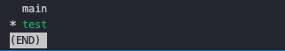

# Git 브랜치(branch)

소프트웨어를 개발할 때 개발자들은 동일한 소스코드를 함께 동유하고 다루게 됩니다. 동일한 소스코드 위에서 어떤 개발자는 버그를 수정하고, 새로운 기능을 만들기도 하는데 서로 동일한 소스코드 기반으로 각각 다른 작업을 할 때 서로 다른 버전의 코드가 만들어 질 수 밖에 없습니다.

이럴 때, 우리는 여러 개발자가 동시에 다양한 작업을 할 수 있게 만들어 주는 기능인 `Git branch`를 사용합니다. `Git branch`는 즉 독립적으로 어떤 작업을 진행하기 위한 개념입니다. 
> 각각의 브랜치는 다른 브랜치의 영향을 받지 않으며, 작업을 동시에 진행할 수 있습니다.

## Git Branch 확인하기

내가 현재 위치한 `Git branch` 확인

```bash
git branch
```


초기 생성 시 `main` 브랜치만 존재하며, `*`로 표시되어 있는 브랜치가 현재 활성화 된 브랜치이다.

```bash
git status
```



위 명령어를 사용해도 내가 현재 어디 브랜치에 있는지 알 수 있다.

```bash
git branch -r
```



원격 저장소의 브랜치를 확인할 수 있다.

```bash
git branch -v
```


브랜치의 마지막 커밋 메세지를 확인할 수 있다.

## git Branch 생성 및 이동

### branch 생성

```bash
git branch test
```

`test` 라는 git branch를 생성한다는 의미다.


### branch 이동

```bash
git switch [브랜치명]
```



방금 생성한 branch로 이동하려면 `git switch`를 이용하여 이동할 수 있다.

### ※ 이 과정을 한번에 하는 과정이 있다.

```bash
git switch -c [브랜치명]
```

브랜치를 만들면서 만든 브랜치로 이동하라는 명령어이다.

### 원격 브랜치와 같은 이름으로 로컨 브랜치를 생성 후 스위치 하는 방법

```bash
git switch -t origin/[원격 브랜치명]
```

## Git branch 변경사항 복원

```bash
git restore .
git restore test.js
```

작업중인 파일을 복원할 수 있다.

### Git stage된 파일 복구

```bash
git restore --staged .
git restore --staged test.js
```

## Git branch 삭제

```bash
git branch -d test
```

### Git 원격 브랜치 삭제

```bash
git push origin --delete [브랜치명]
```

## 생성한 branch를 원격 Repository에 push 하기

### 1. 생성한 branch로 이동한다

```bash
git switch test
```

### 2. git push를 진행한다

```bash
git push --set-upstream origin test  # 로컬 레포지토리에서 리모트 레포지토리로 처음 push 할때 '--set-upstream' 옵션 추가
git push -u origin test # 위와 같은 의미이며 위 명령어를 줄인 명령어

git push # 처음 push 이후 트래킹 정보 설정이 되었을 시 push만 진행해도 사용 가능
```

위의 모든 과정을 마쳤으면 branch가 신규 생성된 것을 볼 수 있으며, 총 2개로 늘어난 것을 볼 수 있다.
