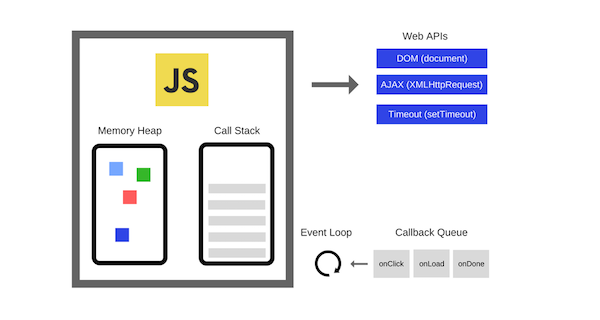

# 이벤트 루프(Event-Loop)

이벤트 루프에 알기 전 우리는 아래와 같은 이야기들을 많이 듣는다.

- 싱글 쓰레드로 동작하는 `JavaScript`
- 이벤트 루프를 기반으로 싱글 쓰레드로 동작하는 `Node.js`

> `JavaScript`는 싱글 쓰레드 인가? `맞다`

`JavaScript`의 메인 쓰레드인 Event Loop가 싱글 쓰레드 이므로 JavaScript는 싱글 쓰레드이다.

`Node.js`는 Chrome V8 JavaScript 엔진으로 빌드된 `JavaScript` 런타임이며, 이벤트 기반으로 구성되어 있기에 비동기 구현이 가능하며, 이로 인해 논 블로킹 I/O 모델이다.

### 여기서 잠깐!

**논 블로킹(Non-Blocking)은 무엇인가?**

`블로킹(Blocking)`은 하나의 작업이 수행된다고 하였을 때 다른 작업은 기다려야하는 방식 뜻한다. 이에 반대되는 뜻은 `논 블로킹(Non-Blocking)`인데 반대로 돌려 이야기 하면 하나의 작업이 끝나지 않아도 다른 작업이 실행 가능하다.

## JavaScript 엔진

`JavaScript 엔진`은 JavaScript로 작성한 코드를 해석하고 실행하는 `인터프리터`이다. 주로 웹 브라우저 엔진에서 이용되지만 최근 `Node.js`의 등장으로 `Chrome V8`과 같은 엔진을 이용한다.

`JavaScript 엔진`과 `Chrome V8 엔진`은 마찬가지로 크게 세 영역으로 나뉜다.

- Call Stack
- Heap
- Task Queue(Event Queue)

이를 관리하는 오늘의 주제인 `Event Loop`

그럼 하나씩 알아보자!

<p style="text-align: center;">
  
</p>

### `Call Stack`

단 하나의 Stack이며, Event 요청이 들어오면 하나씩 `Push 형태`로 쌓이며 순차적으로 실행된다.(해결 시 `pop 형태`로 `stack`에서 제거)

### `Heap`

동적으로 생성된 객체는 힙에 저장된다.

### `Web APIs`

웹 브라우저에서 제공하는 API로 AJAX나 Timeout등의 비동기 작업을 실행 \
ex) 비동기 처리 함수의 콜백 함수, 비동기식 이벤트 핸들러, Timer 함수(setTimeout(), setInterval())의 콜백 함수

### `Event Queue`

JavaScript 런타임 환경에서 처리해야하는 Task들을 임시 저장하는 Queue 이다.

> 여기서 중요한 개념은 `Call Stack이 비어졌을 때` 순차적으로 먼저 들어온 대기열 부터 순서대로 수행되는데 `Call Stack으로 이동 후 실행`된다.

### `Event Loop`

`Event Loop`는 `Call Stack` 내에서 스택이 없는지와 `Event Queue` 내에 스택이 없는지를 계속 체크한다. 만약 `Call Stack`이 비어있다면 `Event Queue` 내에 있는 테스크를 `Call Stack`으로 이동 시킨 후 실행한다.

### 위 내용들을 리마인드 하며, 예제로 전체적인 것을 그려보자!

```js
function func1() {
  console.log('func1');
  func2();
}

function func2() {
  setTimeout(function () {
    console.log('func2');
  }, 0);

  func3();
}

function func3() {
  console.log('func3');
}

func1(); // ?
```

위 예제를 보자 마지막 `func1()`을 실행했을 때 `console.log()`가 어떤 순서로 찍힐까? 하나씩 알아보자!

1. `func1()` 호출이 되면 `func1()`가 `Call Stack`에 쌓인다.
2. `func1()` 에서 `func2()`를 호출하므로 `func2()`가 `Call Stack`에 쌓인다.
3. `func2()`가 `Call Stack`에 쌓이면, 동시에 `setTimeout` 함수가 실행되고, `Call Stack`에 쌓인 후 바로 `Web API`로 이동한다. 비동기적으로 Web API에서 지정한 대기 시간 만큼 `tick` 이벤트가 발생하면, `Event Queue`로 이동 후 `Event Loop`가 `Call Stack`이 비어져 있는 것을 확인하면 `Call Stack`으로 이동 시켜 실행한다.
4. `func3()`가 `Call Stack`에 쌓인다.

**처리결과**

1. `func1()`이 실행되어 `func1`을 콘솔 로그에 찍는다.
2. `func2()`가 실행된다.
3. `func3()`이 실행되어 `func3`을 콘솔 로그에 찍는다.
4. 모든 `Call Stack`이 차례대로(`func3() -> func2() -> func1()`) 실행된 후 `Call Stack`이 비어져 있는 것은 확인 후 `Event Queue`에 있는 함수를 실행시켜 `func2`가 실행된다.

```bash
func1
func3
func2
```

> 여기서 중요한 점은 `Event Queue`에 걸려 있는 핸들러는 절대로 먼저 실행될 수 없다.

## 비동기 Event Loop

### `Microtask`

주로 아래의 목록들을 사용한 함수나 프로그램이 종료된 후 `Call Stack`이 비어져있을 때 실행되는 짧은 함수이다.

- Promise callback
- queueMicrotask

### `Macrotask(Task Queue === Event Queue)`

`이벤트 루프의 Stack`이나 `Microtask`가 비어져있을 때 실행되는 짧은 함수이다.

- setTimeout
- setInterval
- setImmediate

실행 순서는 `Microtask` -> `Macrotask` 순서로 실행된다.

1. `Call Stack`에 모든 함수가 실행되면 모든 Stack은 빠져나가게 된다.
2. `Call Stack`이 비어졌을 때, 대기 중인 `Microtask`가 `Call Stack`으로 이동하여 실행된다.
3. `Microtask`이 `Call Stack`으로 이동하여 모두 실행되면, `Macrotask`이 `Call Stack`으로 이동하여 실행된다.

```js
console.log('test1');

setTimeOut(() => {
  console.log('test2');
}, 0);

Promise.resolve('Promise')
  .then(res => console.log(res));

console.log('test3');
```

위 결과는 아래와 같다.

```bash
test1
test3
Promise
test2
```
